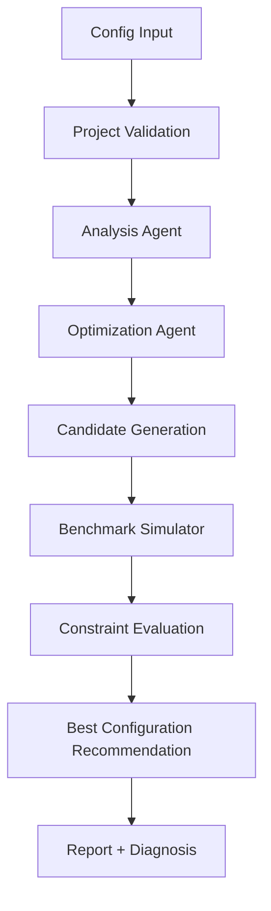
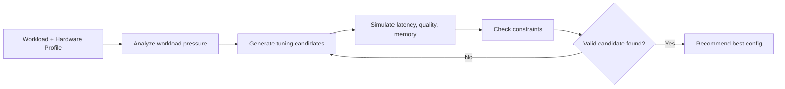
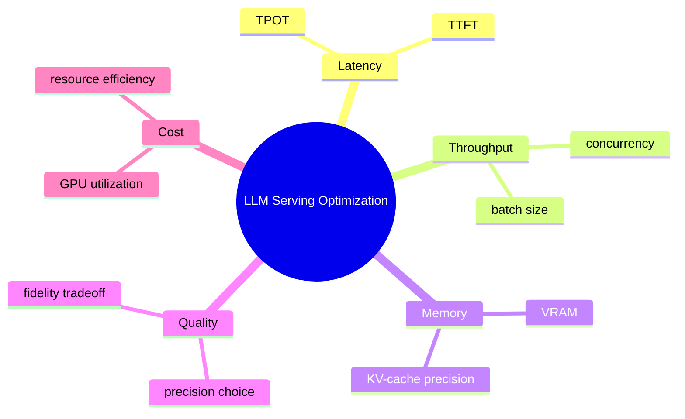

# LLMOpt-Agent

<div align="center">


</div>

LLMOpt-Agent is a prototype optimization workflow for LLM inference tuning. It evaluates model precision, KV-cache precision, and batch-size configurations, then recommends the best-performing setup for a given workload under latency and quality constraints.

> This project is designed to make inference optimization systematic, testable, and easy to extend. The current benchmark layer is intentionally a deterministic simulator rather than a real GPU benchmark, which keeps the system lightweight, portable, and easy to reason about while demonstrating the end-to-end optimization loop.

---

## Why this project exists

## Why this project exists

Serving large language models efficiently requires balancing several tradeoffs:

- latency vs. throughput
- memory usage vs. model quality
- batch size vs. response time
- lower precision vs. model fidelity

This project automates that search process by:

- analyzing the workload and hardware profile
- generating candidate configurations
- simulating expected benchmark outcomes
- checking constraint satisfaction
- selecting the most promising valid configuration

<div align="center">

```text
Latency   +   Memory   +   Quality   +   Cost
   ↓          ↓          ↓          ↓
Smart inference tuning decisions
```

</div>

## What it does

The workflow includes four main stages:

1. Analysis stage
   - identifies workload type
   - checks concurrency pressure
   - estimates memory characteristics

2. Optimization stage
   - generates candidates for precision, KV-cache precision, and batch size
   - prioritizes settings with strong efficiency potential

3. Benchmark simulation
   - estimates TTFT, TPOT, throughput, VRAM, quality score, and GPU utilization
   - evaluates whether the configuration satisfies latency and quality constraints

4. Evaluation stage
   - selects the best valid candidate
   - decides whether additional search is needed

## Example workflow

The project reads a JSON config such as the following:

```json
{
  "model_name": "Llama-3.1-8B-Instruct",
  "hardware": {
    "vendor": "AMD",
    "gpu": "MI355X",
    "vram_gb": 192,
    "memory_bandwidth_gbps": 8000
  },
  "workload": {
    "prompt_tokens": 4096,
    "output_tokens": 512,
    "concurrency": 32,
    "target_ttft_ms": 100,
    "target_quality": 0.98
  },
  "search_space": {
    "precisions": ["fp16", "fp8", "int8"],
    "kv_cache_precisions": ["fp16", "fp8"],
    "batch_sizes": [8, 16, 32]
  },
  "max_iterations": 2
}
```

The project then evaluates multiple combinations and prints the best valid recommendation.

## Architecture overview



This architecture is intentionally simple and modular, making it easy to upgrade the benchmark backend or connect to a real inference engine later.

## Optimization loop in plain English



This loop captures the central idea of the project: search across a constrained space, evaluate tradeoffs, and recommend a configuration that balances performance and quality.

## Key Features

- workload-aware analysis of LLM inference demand
- candidate generation across precision, KV-cache, and batch-size settings
- deterministic benchmark simulation for latency, throughput, memory, and quality
- constraint validation for TTFT and quality targets
- modular optimization workflow with easy extension points
- clean Python project structure for experimentation and future backend upgrades

<div align="center">

| Area | Capability |
|---|---|
| Workload analysis | Detects prompt-heavy vs. decode-heavy patterns |
| Tuning | Explores precision, KV-cache, and batch size combinations |
| Benchmarking | Estimates latency, throughput, memory, and quality |
| Decision logic | Chooses the best valid configuration under constraints |

</div>

## Tech Stack

- Python 3
- Pydantic for validation and data modeling
- LangGraph-style workflow orchestration pattern
- deterministic benchmark simulation
- pytest for test coverage
- JSON-based configuration-driven design

## Why this project matters

LLM deployment is not only about model quality; it is also about making the right tradeoff decisions under real operational constraints. This project focuses on one of the most important problems in modern inference systems: how to choose the right serving configuration when balancing latency, throughput, memory usage, and model quality.

For teams operating large language models in production, these tradeoffs are expensive to tune manually. LLMOpt-Agent explores that decision space in a structured way and provides a practical foundation for more advanced optimization systems that can later integrate with real benchmark backends, hardware telemetry, and serving platforms.

> In short: the project is about making intelligent inference tuning easier, more systematic, and more data-driven.

## Project Status / Future Roadmap

### Current status

- V1 prototype completed
- deterministic simulator implemented
- end-to-end optimization workflow validated
- modular architecture established for future extension

### Planned roadmap

- integrate real inference backends and hardware-level measurements
- add more optimization strategies and search heuristics
- support adaptive iteration and policy-guided tuning
- expose results through a dashboard or API layer
- connect with real serving metrics and production ML infrastructure

<div align="center">

```text
Prototype → Benchmark Backend → Real GPU Validation → Production Optimization Layer
```

</div>

## Run locally

### Windows PowerShell

```powershell
python -m venv .venv
.venv\Scripts\Activate.ps1
pip install -r requirements.txt
python -m app.main --config configs/example.json
```

### Linux/macOS

```bash
python3 -m venv .venv
source .venv/bin/activate
pip install -r requirements.txt
python -m app.main --config configs/example.json
```

## Example output

The project produces a report in the following format:

```text
=== LLMOpt-Agent Report ===
Model: Llama-3.1-8B-Instruct
GPU: MI355X
Workload: prefill_heavy
Diagnosis: Candidate satisfies the quality/TTFT constraints. Further search can test whether a better throughput-memory tradeoff exists.

Recommended configuration:
{
  "precision": "fp8",
  "kv_cache_precision": "fp8",
  "batch_size": 32
}

Measured/simulated metrics:
  ttft_ms: 87.45
  tpot_ms: 12.568
  throughput_tok_s: 125.395
  vram_gb: 13.75
  quality_score: 0.99
  gpu_utilization_pct: 95.7
  passed_constraints: True
```

## What the project optimizes



This chart reflects the central idea behind the project: identify the best configuration that meets service constraints while improving efficiency.

## Project structure

```text
llmopt-agent-main/
├── app/
│   ├── agents.py
│   ├── benchmark.py
│   ├── config.py
│   ├── graph.py
│   ├── main.py
│   ├── models.py
│   └── tools.py
├── configs/
│   └── example.json
├── tests/
│   └── test_core.py
├── requirements.txt
├── README.md
├── PUBLISHING.md
├── proof-output.txt
├── .env.example
└── .gitignore
```

## Current status

This project is a V1 prototype and should be viewed as a research and learning project focused on:

- LLM inference optimization
- workload-aware tuning
- benchmark simulation
- automated configuration search
- agentic decision-making for model deployment tradeoffs

It is not yet a real hardware benchmark suite or a production-scale serving system. The benchmark layer intentionally uses deterministic estimates rather than live GPU measurements so the architecture can be tested, extended, and improved without requiring expensive hardware in the early stages.

## Technical notes

The project is intentionally designed to be:

- deterministic
- debuggable
- easy to test
- portable
- extensible for real benchmark backends

The simulator is meant to be replaced later with real measurements from:

- vLLM
- PyTorch
- ROCm/HIP
- FP16 / BF16 / FP8 / INT8
- KV-cache tuning
- continuous batching
- TTFT and TPOT benchmarking

## Roadmap

Planned improvements include:

- real inference backend integration
- richer search strategies
- adaptive optimization loops
- dashboard or API-based reporting
- integration with actual serving metrics and hardware telemetry

## License

This project is provided as an educational and research prototype for LLM inference optimization and workload-aware tuning.
